# Práctica: Bug trackers y HelpDesk

## ngDesk

## ¿Qué es ngDesk?

**ngDesk** es un software de servicio técnico completo y con variantes de pago y gratuitos para cada paso del ciclo de la vida de la atención al cliente.

## Introducción 

En está guía vamos a realizar un "Getting Started" del servicio ngDesk. Para ello trataremos los puntos iniciales más importantes de dicho servicio, estos son los siguientes:

1. Registro en la web oficial del servicio.
2. Configurar los caneles de soporte esenciales.
3. Configurar la base de datos de conocimientos.
4. Definir el nivel de acceso de los usuarios.
5. Uso de tickets personalizados.
6. Configurar automatizaciones.

## Registro en la web oficial del servicio.

Lo primero que haremos será acceder a la [web oficial](https://ngdesk.com/). Una vez dentro, nos desplazaremos dentro de ella hacía abajo hasta encontrar los diferentes **planes** que nos ofrece la web. En nuestro caso, escogeremos el plan **gratuito** ya que se trata de una guía de carácter educativo. Al tratarse del plan gratuito no vamos a poder disfrutar de todas sus funcionalidades.

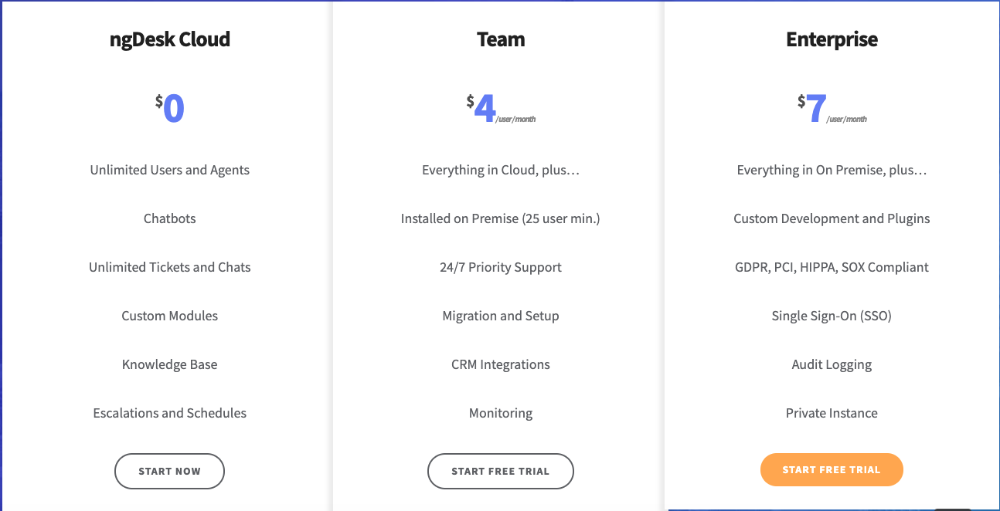 

Una vez escogido el plan **gratuito** se nos mostrará la siguiente ventana. En dicha ventana se nos pide cumplimentar una serie de datos para comenzar con el registro de nuestro usuario en el servicio.

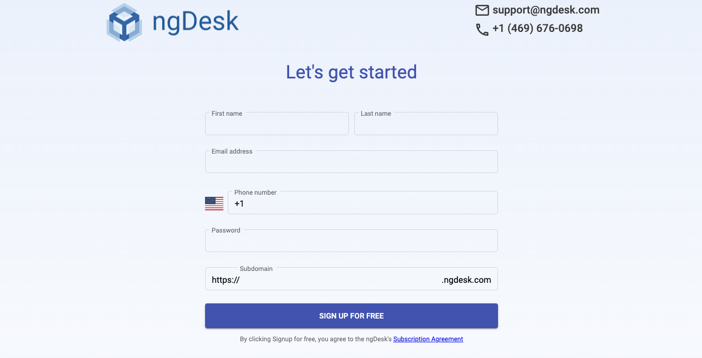

Una vez rellenados todos los campos seleccionamos el botón ***Sign up for free*** y esperamos unos 10 segundos a que se complete el registro en el sitio web.

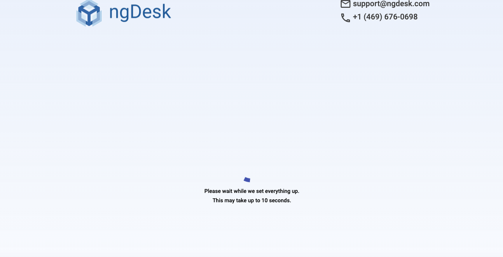

Tras completar el registro lo primero que se nos pide es seleccionar a que **tipo** de industria pertenece nuestra empresa. En nuestro caso seleccionamos el sector tecnológico. 

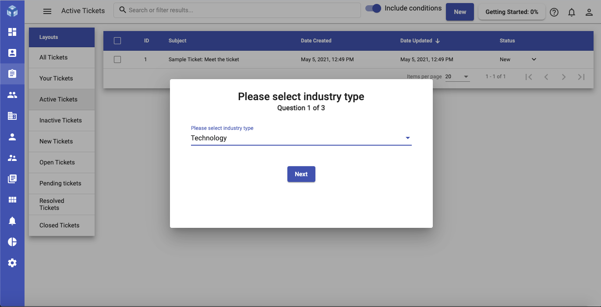

Seleccionamos el botón ***next*** y continuamos con los siguientes pasos del asistente. Ahora nos pide seleccionar el **número de empleados** que posee nuestra empresa. En nuestro caso lo dejamos en el número inferior.

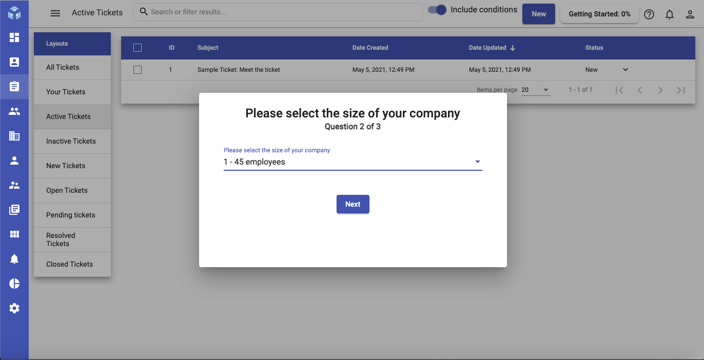

Volvemos a seleccionar el botón ***next*** para finalizar con el asistente. En está ocasión nos pregunta por el motivo de uso de esta herramienta. En nuestro caso, seleccionaremos **ambas** opciones para disponer de todas las funcionalidad que nos ofrece. 

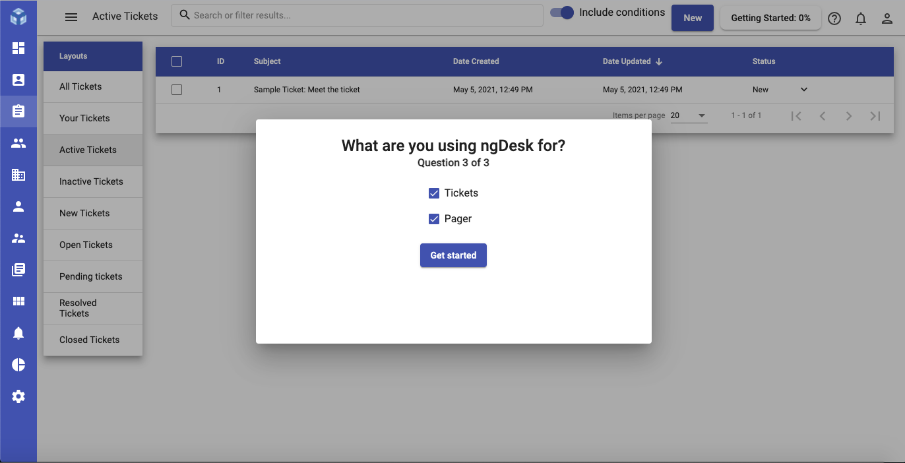

Como paso final del registro nos da la posibilidad de **personalizar** un poco nuestro entorno de trabajo para sentirnos más agusto dentro del mismo.

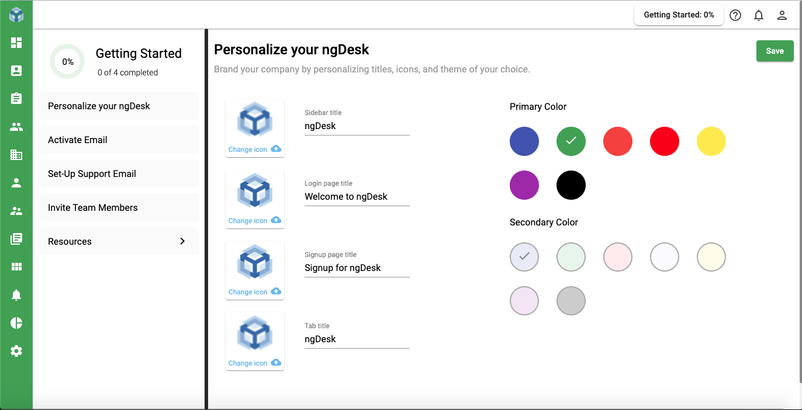

 Para finalizar con todo el proceso de registro, deberemos **verificar** nuestro correo electrónico de ***inicio de sesión*** y también proporcionar un correo de **soporte** tal y como se ve las siguientes ***2 imágenes***.

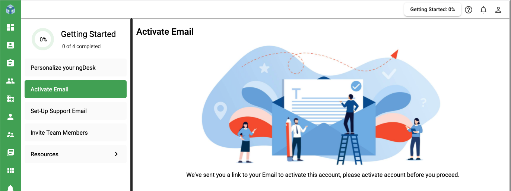

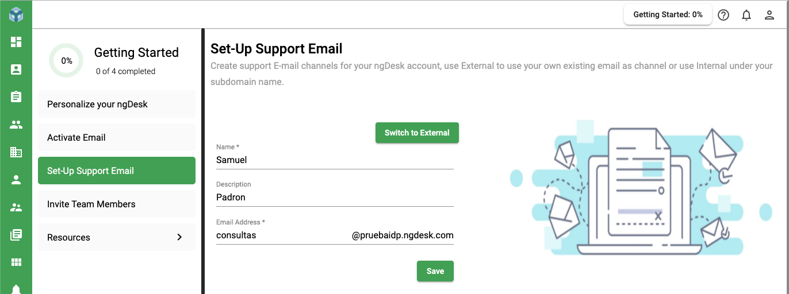

## Configurar los canales de soporte esenciales

Ahora procederemos a configurar los diferentes canales de soporte que nos proporciona dicha herramienta. En la versión de **pago** podremos disfrutar de numerosos canales, entre ellos: ***FaceBook***, ***E-mail***, ***SMS***, ***etc*** ... Sin embargo, en la versión **gratuita** únicamente podremos disfrutar del ***E-mail***.

Para configurar dicha opción debemos irnos a "**Modules**" y dentro de ella a la opción "**Contacts**" visualizando así las dos siguientes ventanas respectivamente.

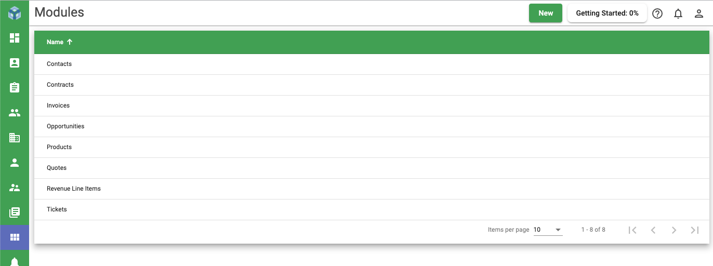

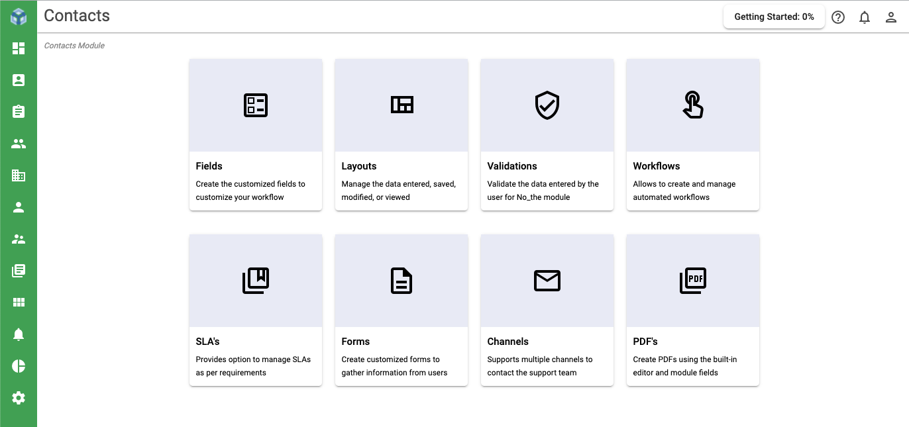

Dentro de "**Contacts** " buscamos la opción "**Channels**" y únicamente nos aparecera la opción "**E-mail**", pinchamos sobre ella y visualizaremos la siguiente ventana. En ella, se nos pide rellenar una serie de datos relacionados con el servicio que queremos poner en funcionamiento.

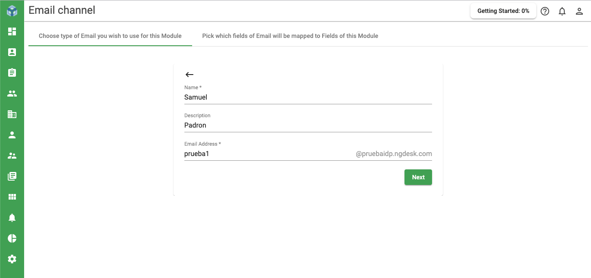

Al hacer clic en ***next*** se nos abrirá la siguiente ventana del asistente. En ella seleccionaremos los ***asuntos*** que manejará dicho correo y otra serie de parámetros que podemos observar en la siguiente imagen. Esto lo configuraremos a nuestro gusto.

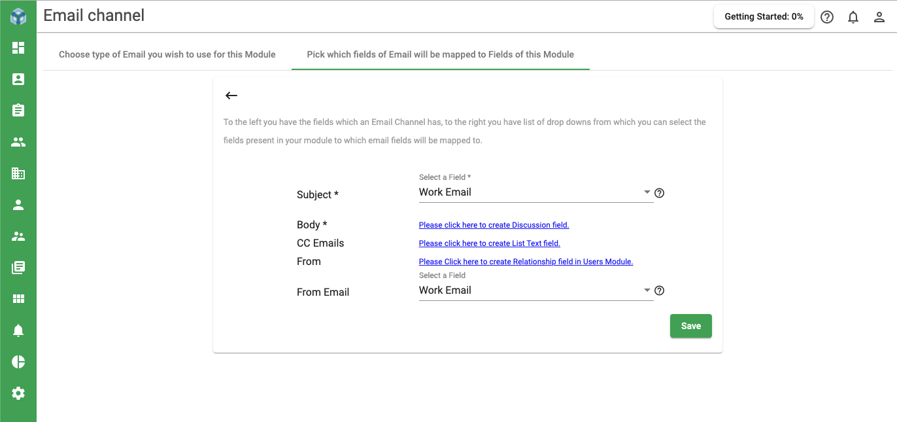

Una vez finalizados los pasos del asistente ya tendremos nuestro "***Canal de comunicación*** creado. Deberemos observar algo como lo siguiente.

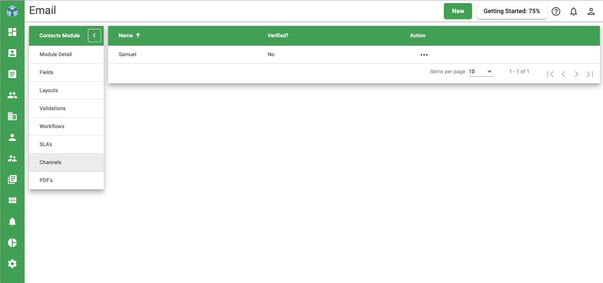

## Configurar la base de datos de conocimientos

Está es una opción bastante últil que nos propone este servicio. Gracias a ella podremos configurar por ejemplo las típicas ***FAQ´S*** que poseen las grandes páginas webs. Así, ahorraremos bastante tiempo en contestar correos con problemas o dudas, pues posiblemente, los usuarios puedan encontrar la solución a sus problemas en las ***FAQ'S*** sin tener la necesidad de contactor con el soporte técnico de la empresa. Vamos a ver como podemos configurarlo.

Lo primero será irnos a la ventana de "**Knowledge Base**", una ventana como la que vemos a continución.

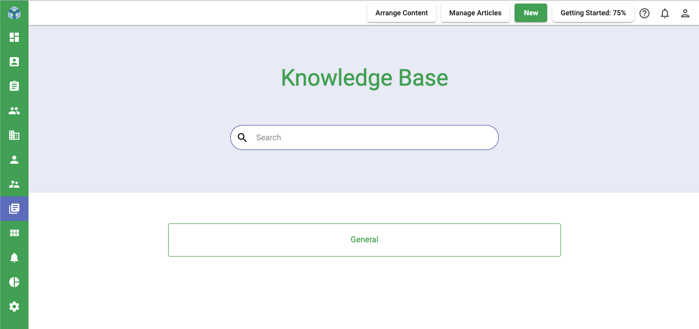

Luego seleccionaremos la opción **New** que se encuentra en la parte superior de la ventana.

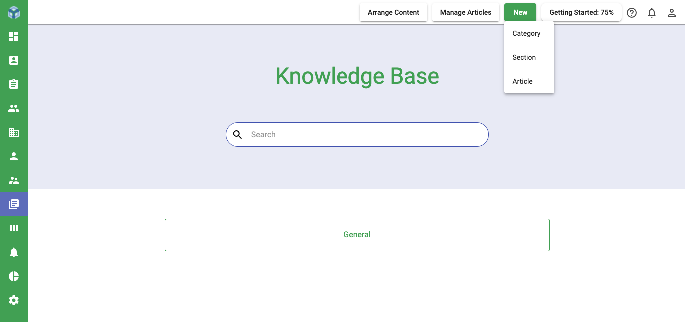

Y ahora seleccionaremos por ejemplo la opción "**Article**" para generar un número ***reporte*** por así decirlo. Al seleccionar dicha opción se nos abrirá la siguiente ventana.

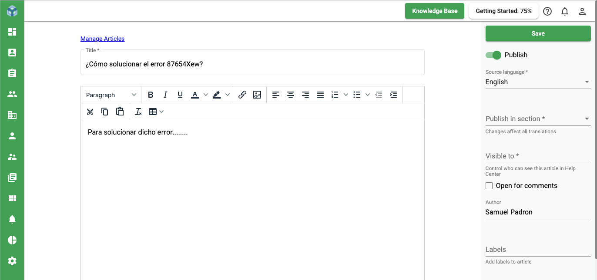

En nuestro caso, no nos hemos complicado ya que se trata de un mero ejemplo. Como se puede observar en la imagen anterior, hemos colocado un **título**, en este caso con el nombre del error para que sea fácilmente localizable por el usuario y de además una **descripción** donde explicaríamos la solución de dicho problema.

Para finalizar con este "**Article**" seleccionamos la opción "**Save**" y como podemos ver ya contamos con el artículo de solución al problema en las ***FAQ'S***.

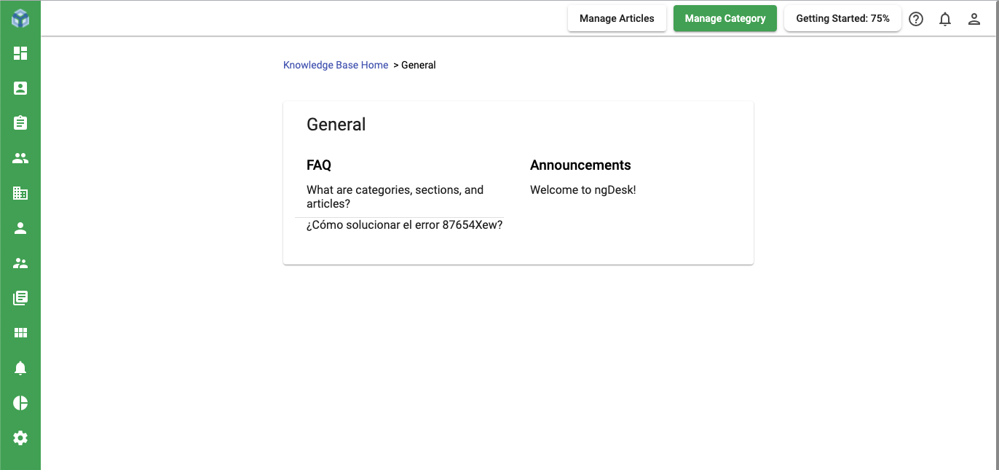

## Definir el nivel de acceso de los usuarios

Otro punto importante consiste en establecer restricciones a la hora de conceder permisos sobre lo que pueden o **no** pueden hacer los diferentes usuarios que tienen acceso a esta herramienta. Para ello, vamos a acceder a los ***ajustes de la compañía***.

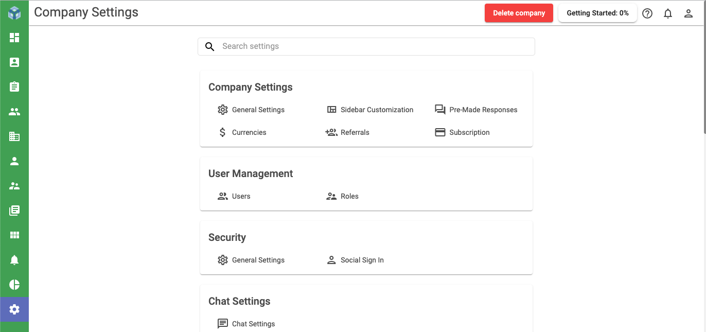

Dentro de "**User Management**" entramos en la opción "**Roles**" y visualizaremos la siguiente ventana.

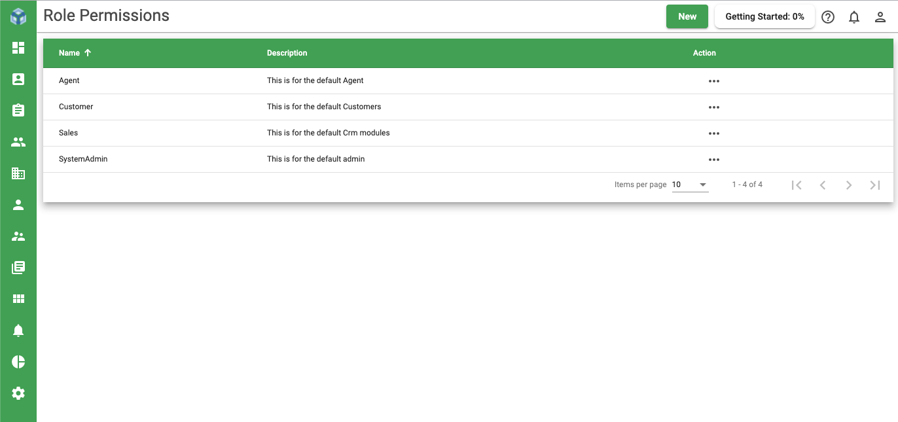

Ahora haremos clic en la opción ***new*** y se nos abrirá la siguiente ventana. En ella, podemos personalizar los roles de los usuarios a nuestro gusto.

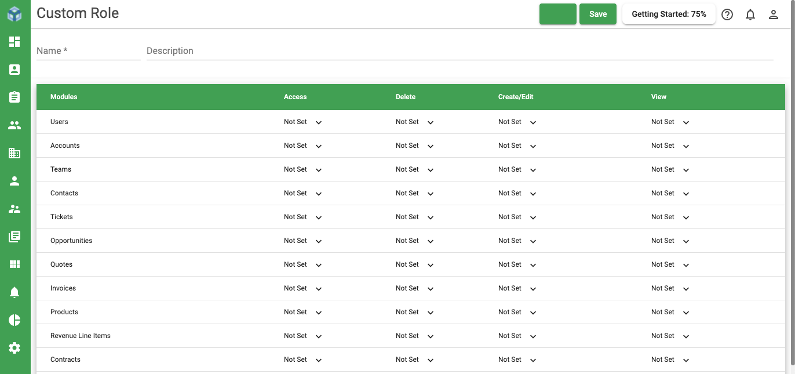

Una vez finalizado este paso ya tendríamos los roles puestos a nuestro gusto.

## Uso de tickets personalizados 

En este apartado veremos como configurar meramente los tickets que queremos que el sistema genere o también los podemos generar nosotros mismos. Para ello accederemos al siguiente apartado y vemos que dispones de un ticket ya generado de forma automática como prueba.

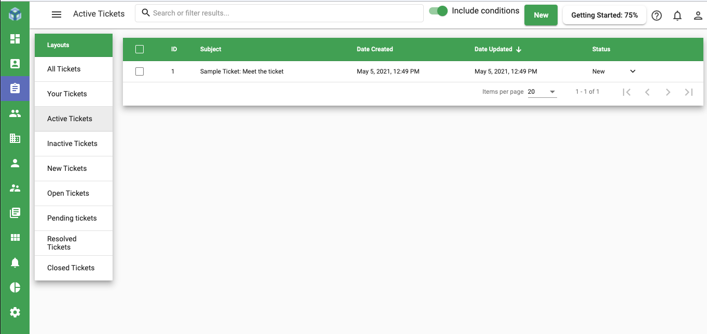

Entraremos de este ticket y como su propio nombre indica, nos invita a conocer su estructura y lo que podemos hacer con él. Como vemos, es algo muy sencillo. Dentro de él nos permite añadir un texto, un asunto, adjuntar archivos y demás opciones para proporcionarle una respuesta adecuada a cada cliente de forma personalizada.

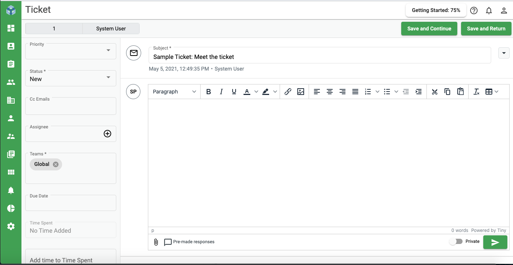

Haciendo uso de la opción "***Pre-made respondes***" prodemos crear respuestas prefabricadas. Estas respuestas podrían ser las típicas que nos encontramos en numerosos correos que recibimos a diario. Para crear una simplemente pinchamos sobre la opción y observaríamos la siguiente ventana en la que creamos dicha respuesta.

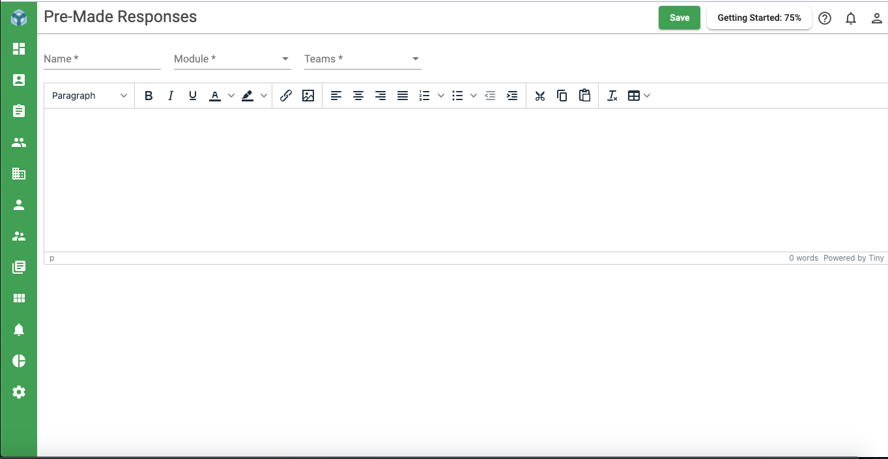

## Configurar automatizaciones

Por último trataremos uno de los puntos más útiles de este servicio, la **automatización**. Esto nos permitirá enviar correos de forma automática a los clientes y miles de opciones más que nos simplificarán mucho el trabajo diario.

Para ello lo primero que tenemos que hacer es acceder a la opción "***Tickets***" y posteriormente nos iremos a "***Workflows***" para poder configurar estos procesos.

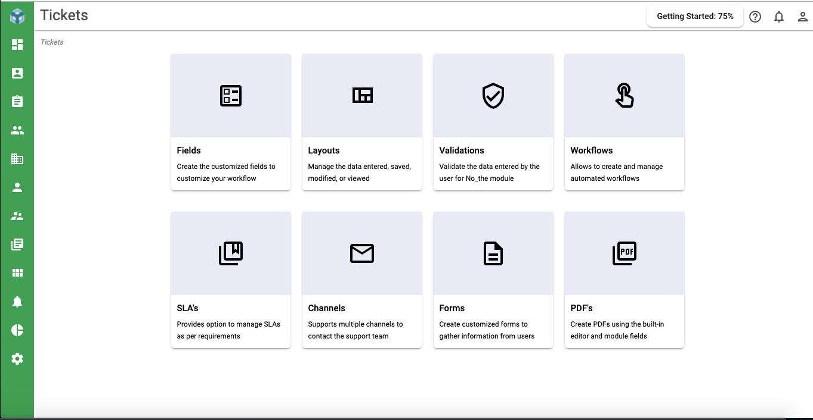

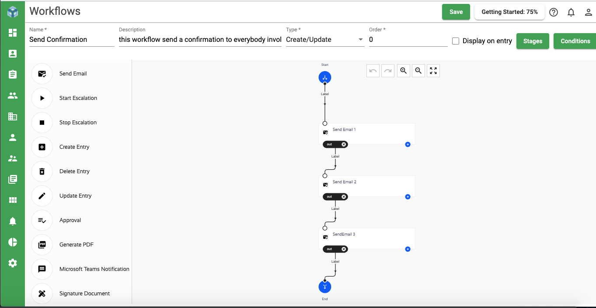

## Referencias

[Vídeo oficial del servicio.](https://www.youtube.com/watch?v=CF2Aa9cGRVM&ab_channel=ngDesk)

[Página web oficial.](https://ngdesk.com/)

### Créditos

Samuel Padrón Padrón

